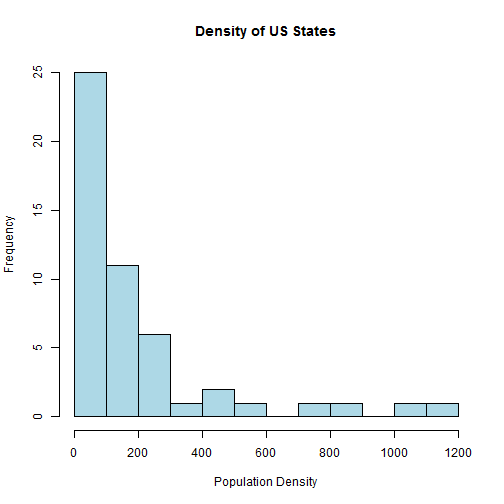
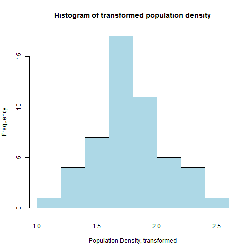
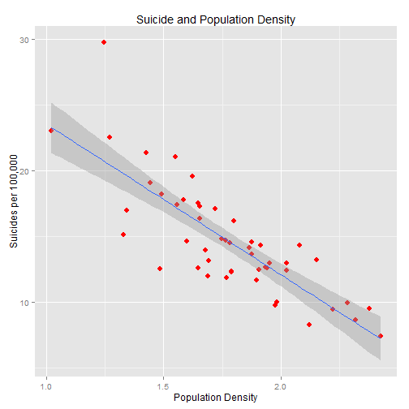
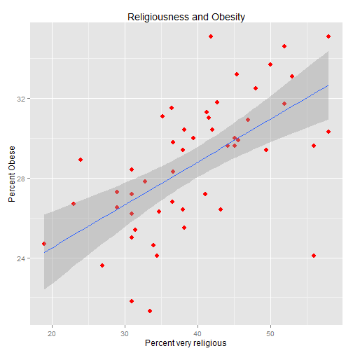
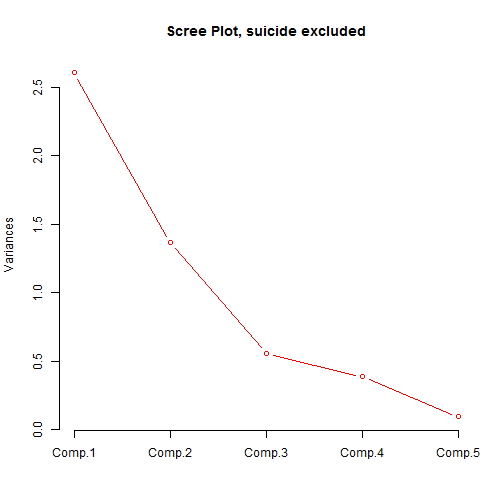
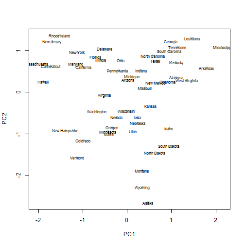
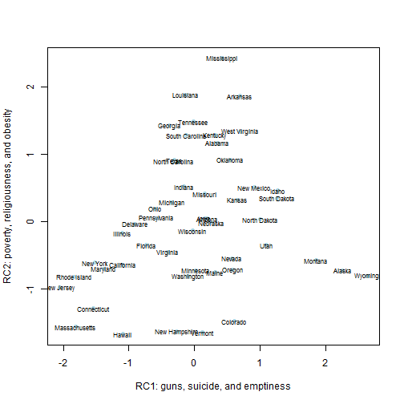

### Introduction

This is a light-hearted statistical analysis of America.  I say light-hearted, because I am not going to defend or justify my approach, or worry that my data or statistical procedures are inadequate or amateurish.  I just want to have fun.

My focus is the fifty American states, and how their metrics on six measures relate to each other.  These metrics are as follows:

* Gun ownership (percentage, 2001)
* Religiousness (percent regarding themselves as strongly religious, 2013)
* Suicide rate (per 100,000, 2012)
* Obesity rate (percentage, 2013)
* Poverty rate (percentage, 2011-2013)
* Density (people per square mile, 2010)

Some of this data might be suspect or dated.  Gunownership comes from 2001 figures, elicited by  the Behavioral Risk Factor Surveillance System (BRFSS).  The figure is based on interviews, so it is possible that people might not have been telling the truth.  The religiousness figures came from Gallup and the suicide figures were reported by the CDC in 2014.  The obesity figures are for 2013, and they come from the BRFSS.  Poverty represents the percent of people in poverty, using a three year average from 2011 to 2013.  The source is the US Census Bureau. The US Census Bureau is also the source of the population density, for the year 2010. The religiousness survey comes from Gallup, and was published at the beginning of 2013.

It is a limited data set, covering each of the 50 US states.  I wanted to see what characteristics of the 50 states correlated with each other, and I wanted to look at the inter-relationship of factors such as obesity and religious conviction.  The techniques I will be using include correlation, regression, and factor and cluster analysis.  

### Descriptives and transformations

Let's have a look at the raw data:

```
##      gunown         relig         suicide     
##  Min.   : 6.7   Min.   :19.0   Min.   : 7.39  
##  1st Qu.:31.4   1st Qu.:33.0   1st Qu.:12.36  
##  Median :40.0   Median :38.2   Median :14.05  
##  Mean   :37.6   Mean   :39.6   Mean   :14.60  
##  3rd Qu.:44.0   3rd Qu.:45.3   3rd Qu.:17.07  
##  Max.   :59.7   Max.   :58.0   Max.   :29.77
```

```
##     obesity        poverty        density      
##  Min.   :21.3   Min.   : 8.3   Min.   :   1.2  
##  1st Qu.:26.4   1st Qu.:11.2   1st Qu.:  44.5  
##  Median :29.4   Median :13.9   Median :  98.8  
##  Mean   :28.7   Mean   :14.1   Mean   : 195.0  
##  3rd Qu.:31.0   3rd Qu.:16.2   3rd Qu.: 209.5  
##  Max.   :35.1   Max.   :21.4   Max.   :1195.5
```
When we look at this data, we have to remember that each state is being given the same weighting, without regard for population.  Sparsely populated Wyoming is having the same impact on the means as California and New York.  

We can see that in terms of population density, there are wide disparities:
 

The distribution has considerable positive skew, so I am going to transform the data.  Remembering that I am doing this for fun, I am going to use a triple square root transformation.  This means taking the square root of the densities, taking the square root of that, and then taking the square root of that.  So Alabama's population density of 94.4 is tranformed to 1.77.  The square root of 94.4 is 9.72, the square root of 9.72 is 3.12 and the square root of 3.12 is 1.77.  After the transformation, we get the following roughly bell-shaped histogram for density:

 

Further mention of density will refer to the tranformed figures:

```
##    Min. 1st Qu.  Median    Mean 3rd Qu.    Max. 
##    1.02    1.61    1.78    1.78    1.95    2.42
```

### Correlations

One can check the correlations of the six variables, the table of Pearson correlations being followed by the p values:


```
##          gunown relig suicide obesity poverty densityT
## gunown     1.00  0.45    0.66    0.52    0.22    -0.79
## relig      0.45  1.00    0.07    0.60    0.55    -0.14
## suicide    0.66  0.07    1.00   -0.01    0.07    -0.82
## obesity    0.52  0.60   -0.01    1.00    0.47    -0.10
## poverty    0.22  0.55    0.07    0.47    1.00    -0.05
## densityT  -0.79 -0.14   -0.82   -0.10   -0.05     1.00
## 
## n= 50 
## 
## 
## P
##          gunown relig  suicide obesity poverty densityT
## gunown          0.0010 0.0000  0.0001  0.1318  0.0000  
## relig    0.0010        0.6131  0.0000  0.0000  0.3172  
## suicide  0.0000 0.6131         0.9525  0.6058  0.0000  
## obesity  0.0001 0.0000 0.9525          0.0007  0.4716  
## poverty  0.1318 0.0000 0.6058  0.0007          0.7150  
## densityT 0.0000 0.3172 0.0000  0.4716  0.7150
```

We notice that religiousness, obesity, and poverty are all correlated with each other.  So states with high poverty rates tend to have elevated levels of obesity and extreme religious faith.  On the other hand, gun ownership, population density, and suicide are corrlelated with one another - although density's correlations with suicide and gun ownership are negative.  In other words, the greater the population density, the lower the percentage of suicides and gun ownership.

 

There is an outler, which is Wyoming.  Although Wyoming is a sparsely populated state, the suicide rate at 29.77 per hundred thousand is substantially higher than what we would expect.

An interesting relationship is that between being obese and being very religious.  From a spiritual point of view this is not what one would expect.  Good Christians are supposed to have moderate lifestyles, and to regard the body as being a temple.  However the scatter plot tells another story:
 

There is one notable outlier, and that is Utah.  Utah is one of the most relgious states in the Union, with 56% of the population being very religious, and an obesity rate of 24.1%.  Utah has a large Mormon population, and it may be that the psychosocial make-up of the Mormon community is fundamentally different than that of more mainstream Christian communities.

### Regression

We then have to consider poverty.  It is possible that obesity is a surrogate for poverty, though the raw correlations suggest otherwise.  We can start by doing a linear regression, with obesity as the dependent variable and poverty as the predictor variable:

```
## 
## Call:
## lm(formula = obesity ~ poverty, data = usa)
## 
## Residuals:
##    Min     1Q Median     3Q    Max 
## -6.337 -2.190  0.786  2.152  4.873 
## 
## Coefficients:
##             Estimate Std. Error t value Pr(>|t|)    
## (Intercept)   21.820      1.938   11.26  4.5e-15 ***
## poverty        0.489      0.134    3.64  0.00066 ***
## ---
## Signif. codes:  0 '***' 0.001 '**' 0.01 '*' 0.05 '.' 0.1 ' ' 1
## 
## Residual standard error: 2.98 on 48 degrees of freedom
## Multiple R-squared:  0.216,	Adjusted R-squared:   0.2 
## F-statistic: 13.3 on 1 and 48 DF,  p-value: 0.000663
```

This doesn't tell us much more from what we already know about the poverty-obesity relationship.  The correlation between the two is 0.47, so R-squared is 0.216.  So there is a relation, but it only accounts for 21.6% of the shared variance.  So let's do another regression, this time adding religiousness:


```
## 
## Call:
## lm(formula = obesity ~ poverty + relig, data = usa)
## 
## Residuals:
##    Min     1Q Median     3Q    Max 
## -6.682 -2.078  0.449  2.008  5.339 
## 
## Coefficients:
##             Estimate Std. Error t value Pr(>|t|)    
## (Intercept)  18.8020     1.9243    9.77  6.7e-13 ***
## poverty       0.2069     0.1432    1.45  0.15505    
## relig         0.1766     0.0489    3.61  0.00074 ***
## ---
## Signif. codes:  0 '***' 0.001 '**' 0.01 '*' 0.05 '.' 0.1 ' ' 1
## 
## Residual standard error: 2.66 on 47 degrees of freedom
## Multiple R-squared:  0.387,	Adjusted R-squared:  0.36 
## F-statistic: 14.8 on 2 and 47 DF,  p-value: 1.03e-05
```
When we introduce obesity, R-squared shoots up to 0.39, so 39% of the shared variance is now explained.  Furthermore, the statistical significance of poverty is now p=0.155, compared to obesity's p<0.001.  This suggests that strong religious belief might have a relationship with obesity, and that poverty in itself may not play a central role.  

One question we might want to ask is whether the variables so far mentioned have any influence on the suicide rate.  One problem of doing a regression might be collinearity - for example, gunownership and density have a very strong correlation.  So to deal with this issue, the five predictor variables that might predict suicide were reduced to their principle components.

We first of all look at these components, suicide excluded, and set up a scree plot:

```
## Importance of components:
##                        Comp.1 Comp.2 Comp.3  Comp.4  Comp.5
## Standard deviation     1.6137 1.1678 0.7454 0.61951 0.30452
## Proportion of Variance 0.5208 0.2728 0.1111 0.07676 0.01855
## Cumulative Proportion  0.5208 0.7936 0.9047 0.98145 1.00000
```

 

It would seem that the optimum number of principle components is 2, so let's set them up:

```
##              PC1     PC2
## gunown    0.8291 -0.5029
## relig     0.7860  0.3578
## obesity   0.7797  0.3107
## poverty   0.6232  0.5209
## densityT -0.5499  0.7842
```
We can now enter them into a regression equation, to look at their relationship to suicide:

```
## 
## Call:
## lm(formula = suicide ~ pc1 + pc2, data = usa)
## 
## Residuals:
##    Min     1Q Median     3Q    Max 
## -4.696 -1.314 -0.233  1.420  8.096 
## 
## Coefficients:
##             Estimate Std. Error t value Pr(>|t|)    
## (Intercept)   14.596      0.376   38.82  < 2e-16 ***
## pc1            1.776      0.380    4.68  2.5e-05 ***
## pc2           -2.820      0.380   -7.42  1.9e-09 ***
## ---
## Signif. codes:  0 '***' 0.001 '**' 0.01 '*' 0.05 '.' 0.1 ' ' 1
## 
## Residual standard error: 2.66 on 47 degrees of freedom
## Multiple R-squared:  0.621,	Adjusted R-squared:  0.605 
## F-statistic: 38.5 on 2 and 47 DF,  p-value: 1.26e-10
```
The regression shows that both components have a significnt impact on the suicide rate, and that they explain 62.1% of the variance.  

### Cluster Analysis

Principle components analysis on its own can give some idea of clustering.  We can see this when we do a plot of the two components just calculated:

 

We can go further with the PCA, by throwing in suicide, and rotating the principle components.  As the original variables are not orthogonal, it makes sense to use the promax method.  We get the following solution:


```
##                PC1      PC2
## gunown    0.794817  0.35438
## relig     0.017765  0.86060
## suicide   0.945580 -0.15398
## obesity  -0.006282  0.85493
## poverty  -0.096573  0.78601
## densityT -0.970614  0.06987
```

The graph of the promax rotation shows how much the original variables have been compacted.  The x axis, rotated component 1, is about guns and suicide and low density.  The higher the score, the more inclined the state is to have a low population density, a high suicide rate, and high gun ownership.  Rotated component 2 relates to obesity, religion, and poverty.  And overall we get a pyramid structure, with mostly liberal, north Eastern states in the bottom left corner, sparsely populated gun-owning states in the bottom-right hand corner, and the apex of the pyramid being the South-Eastern states, with Mississippi at the very top.

 

As far as cluster analysis is concerned, we'll create three clusters, using the k-means procedure.  Bear in mind that with k-means there is a random element - in this example the seed in R was set to 100.  State membership of each cluster is as follows:


#### Cluster 1


```
##  [1] Alabama        Arkansas       Georgia        Indiana       
##  [5] Kentucky       Louisiana      Michigan       Mississippi   
##  [9] Missouri       North Carolina Oklahoma       South Carolina
## [13] Tennessee      Texas          West Virginia 
## 50 Levels: Alabama Alaska Arizona Arkansas California ... Wyoming
```

#### Cluster 2


```
##  [1] California    Connecticut   Delaware      Florida       Hawaii       
##  [6] Illinois      Maryland      Massachusetts Minnesota     New Hampshire
## [11] New Jersey    New York      Ohio          Pennsylvania  Rhode Island 
## [16] Vermont       Virginia      Washington    Wisconsin    
## 50 Levels: Alabama Alaska Arizona Arkansas California ... Wyoming
```

#### Cluster 3


```
##  [1] Alaska       Arizona      Colorado     Idaho        Iowa        
##  [6] Kansas       Maine        Montana      Nebraska     Nevada      
## [11] New Mexico   North Dakota Oregon       South Dakota Utah        
## [16] Wyoming     
## 50 Levels: Alabama Alaska Arizona Arkansas California ... Wyoming
```


We can look at the mean differences of these three clusters, around the six measures:


```
##   cluster gunown
## 1       1  45.02
## 2       2  25.54
## 3       3  44.99
```

```
##   cluster relig
## 1       1 48.81
## 2       2 33.33
## 3       3 38.38
```

```
##   cluster suicide
## 1       1   14.27
## 2       2   11.43
## 3       3   18.66
```

```
##   cluster obesity
## 1       1   32.19
## 2       2   26.85
## 3       3   27.65
```

```
##   cluster poverty
## 1       1   17.09
## 2       2   12.31
## 3       3   13.42
```

```
##   cluster density
## 1       1  118.11
## 2       2  397.21
## 3       3   26.84
```

I'm not sure how useful that cluster analysis is, aside from telling us the obvious.  Cluster 1 is a more conservative group of states, who with the exception of Michigan, tend to vote Republican.  The members of cluster 2 all voted Democrat in the 2012 Presidential election, thought it included the swing states of Ohio, Virginia, and Florida.  Cluster 3 are low density states, which are not necessarily conservative.

We can see that mean gunownership in cluster 2 is substantially below that of clusters 1 and 3, and that cluster 2 is the least religious grouping, and also has the lowest suicide rate. 

### Summary

This was, in essence, a fun exercise.  The data was very limited, and the variables used were somewhat arbitrary.  Still, there were some interesting results.  Suicide, gun ownership, and population density have a strong, mutual association.  People living in areas with a low population density are more likely to own firearms, and they are more likely to commit suicide.  This may be because there is an absence of support networks; alternatively people commiting suicice may be attracted to sparsely populated areas... or perhaps living an isolated existence has a detrimental psychiatric impact.  However we cannot necessarily use this data to blame gun ownership on suicide.  The US suicide rate is not abnormally high, compared with other developed nations.  At 12.5 in 2011, it is almost the same as the OECD average, at 12.4.  We can compare this with the figures for the UK and Japan, two countries that have stringent laws against firearm ownership.  The UK's suicide rate in 2011 was 6.7, Japan's 20.9 - take your pick for the appropriate comparison.  

Another interesting observation was the relationship between religiousness, poverty, and obesity.  It would seem that there is a relationship between states having high obesity rates and those having high rates of people claiming to be very religious, even when poverty is allowed for.  One possible explaination is agency - people who have a strong belief in God may believe that they are not in full control of their lives, and this might extend to their eating habits.  

A factor analysis suggested two components, one relating to guns, suicide, and population density, the other to religiousness, poverty, and obesity.  Of course the data used is very general, and may reflect some of my own prejudices.  However it is possible that they give some picture of the sociopolitical dimensions that underlie American life and culture.

### Links

Suicide: http://www.cdc.gov/mmwr/preview/mmwrhtml/mm6345a10.htm

Obesity: http://stateofobesity.org/adult-obesity/

Gun ownership: http://www.schs.state.nc.us/SCHS/brfss/2001/us/firearm3.html

Poverty: https://www.census.gov/hhes/www/poverty/data/incpovhlth/2013/tables.html

Religiousness: http://www.gallup.com/poll/160415/mississippi-maintains-hold-religious-state.aspx

Population density: http://www.census.gov/compendia/statab/2012/tables/12s0014.pdf
